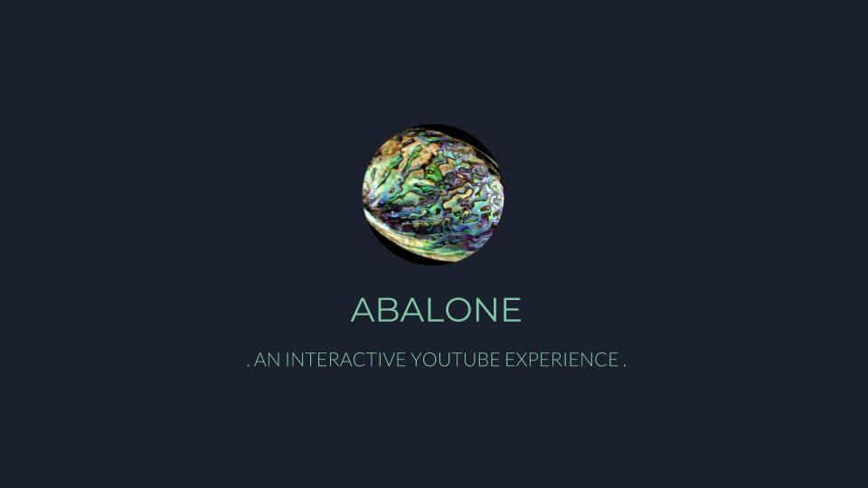
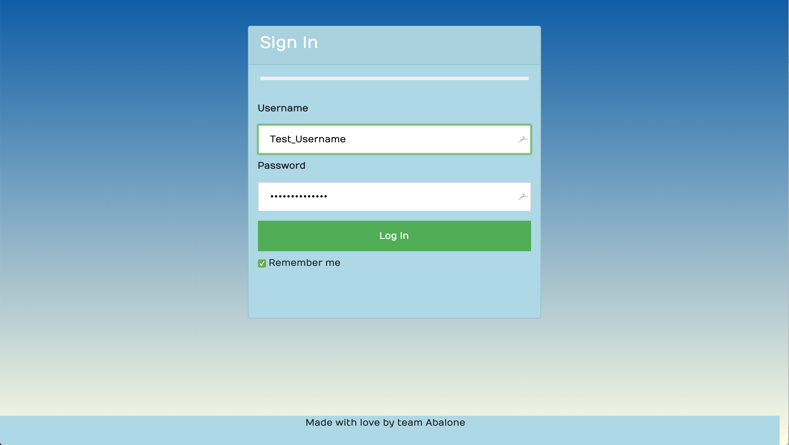

## Site Screenshots and Functionality

## Hackathon Team Members

- Anne-Sophie Le Bloas: https://twitter.com/anneso_special : https://github.com/aslebloas : CEO
- Brent Janski: https://twitter.com/swcosnow : https://github.com/talktobrent : Project Manager
- Leine Fran: https://twitter.com/LeineFran : https://github.com/leinefran : Marketing
- Erwin Gove: https://twitter.com/ErwinEhg50 : https://github.com/Hunt6666 : Marketing
- Jennifer Ogden: https://twitter.com/jogden95 : https://github.com/jogden4195 : Oauth
- Nicole Swanson: https://twitter.com/Nicolette_Swan : https://github.com/thenicopixie: Oauth
- Stephen Chu: https://twitter.com/StephenChu530: https://github.com/stephenchu530: SRE
- Hemant Heer: https://twitter.com/hemant_heer: https://github.com/vortexh: Backend
- Jian Huang: https://twitter.com/GeonAitch: https://github.com/TrieToSucceed: Backend
- Jack Tran: https://twitter.com/JackWanaCode: https://github.com/JackWanaCode: Backend
- Robert Glatzel: https://twitter.com/rglatzell: https://github.com/robertglatzel: Frontend
- Dennis Pham: https://twitter.com/grepdennis: https://github.com/dspham: Frontend
